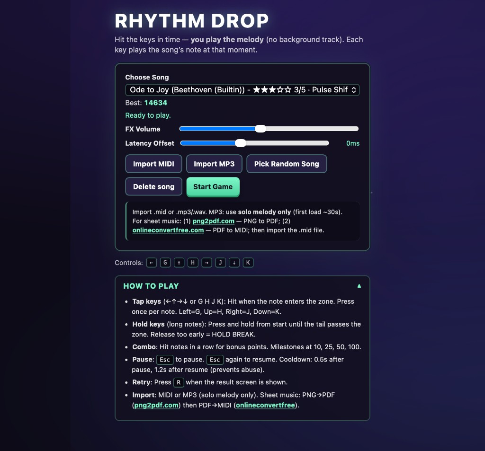
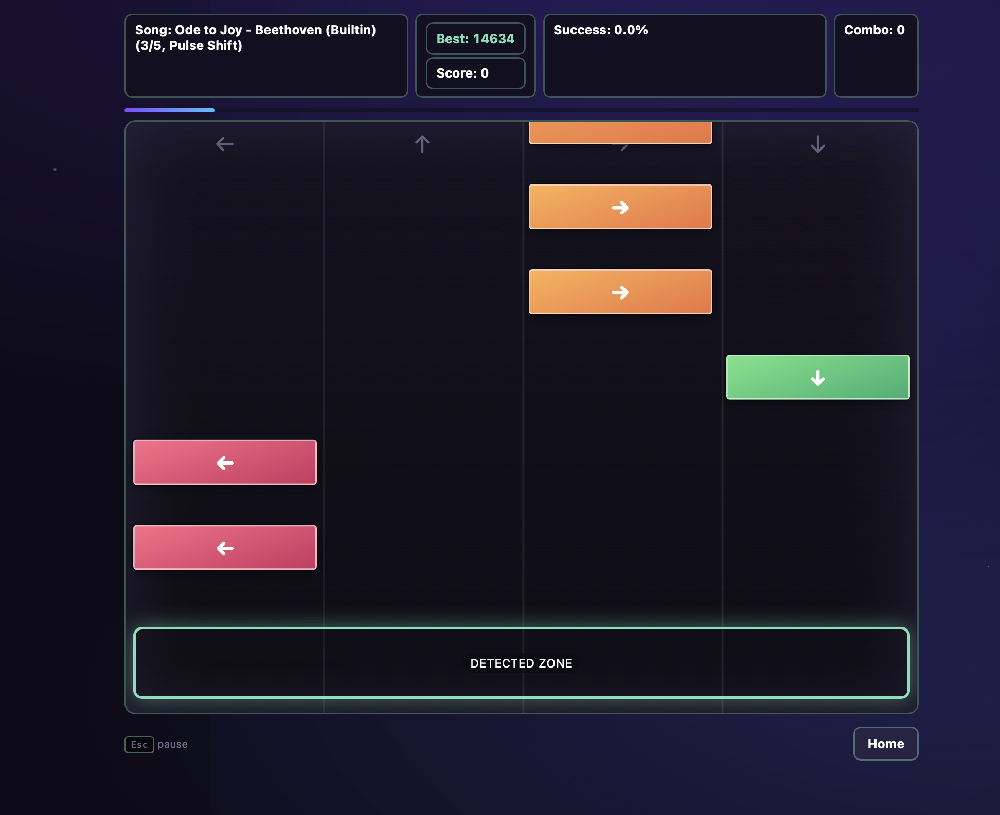

# Rhythm Drop v2 (alpiex1336-code)

<p align="center">
  <br /><br />
  
</p>

## What's New in v2 (vs v1)

v1 had limited features: external MP3 songs where keys did not match the melody, no grade breakdown, arrows only, and no import. v2 is a major upgrade:

### Core gameplay

- **Melody-matching** — v1 used SoundHelix MP3s; keys were timing targets only. v2 uses **builtin melody songs** where each key plays the actual note. Hit all keys correctly and you hear the full song (piano-tiles style).
- **Builtin songs** — Twinkle Twinkle, Mary Had a Little Lamb, Ode to Joy, Fur Elise, Can-Can. All 100% offline; no external audio.
- **Graded hits** — PERFECT, GREAT, GOOD, BAD, MISS with percentage per hit. Result screen shows full grade breakdown (Perfect X | Great X | Good X | Bad X | Miss X).
- **Grading improvements** — Hit-time forgiveness for input delay; wider PERFECT (94%+), GREAT (70%+), GOOD (48%+) thresholds.

### Controls & UX

- **Alternate keys** — `G` / `H` / `J` / `K` map to Left / Up / Right / Down. Use arrows or letter keys.
- **Pause** — `Esc` to pause, `Esc` again to resume.
- **Retry** — `R` when the result screen is shown.
- **How to Play** — Collapsible rules on the home screen.

### Settings & features

- **FX Volume** — Tune effect and accompaniment loudness.
- **Latency Offset** — Compensate for audio/display delay.
- **Import MIDI & MP3** — Add your own songs. MP3 uses AI transcription (Spotify Basic Pitch, first load ~30s).
- **Delete song** — Remove imported songs.
- **Best score** — Per-song best, shown on home and in-game HUD.
- **Progress bar** — Song progress during play.
- **Combo milestones** — Celebrations at 10, 25, 50, 100 combo.

### Difficulty & speed

- **Faster 4★ & 5★** — Faster drop speed for Fur Elise and Can-Can; keys are more separated.

### Technical

- **PWA-ready** — Manifest and service worker for installability.
- **100% offline** — No paid APIs or external CDN for builtin songs.

---

## Quick Start

After downloading this folder:

```bash
cd "$HOME/Downloads/rhythm-drop-v2-alpiex1336-code"
npm install
npm run build
cd dist && python3 -m http.server 8000
```

Or for development (hot reload):

```bash
cd "$HOME/Downloads/rhythm-drop-v2-alpiex1336-code"
npm install
npm run dev
```

Open [http://localhost:8000](http://localhost:8000) (production) or [http://localhost:5173](http://localhost:5173) (dev).

---

## About

Rhythm Drop is a browser rhythm game with:

- Falling arrow lanes (`Left`, `Up`, `Right`, `Down` or `G`, `H`, `J`, `K`)
- Tap and hold notes with graded judgement (PERFECT / GREAT / GOOD / BAD / MISS)
- 5-level difficulty (1★–5★)
- Song selection and import (MIDI / MP3)
- Combo scoring, retry, pause, and result summary with grade breakdown

## Controls

- `ArrowLeft` / `G` → left lane  
- `ArrowUp` / `H` → up lane  
- `ArrowRight` / `J` → right lane  
- `ArrowDown` / `K` → down lane  

Home screen: **FX Volume**, **Latency Offset**, **Import MIDI**, **Import MP3**, **Delete song**.

## Builtin Songs

- Twinkle Twinkle
- Mary Had a Little Lamb
- Ode to Joy
- Fur Elise Intro
- Can-Can Theme

## 100% Offline

No paid APIs or external CDN. All game assets are in this folder.

## License

MIT License. See `LICENSE`.
